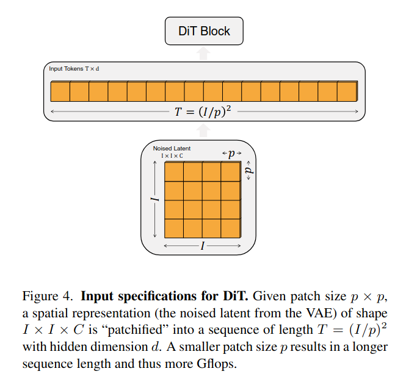
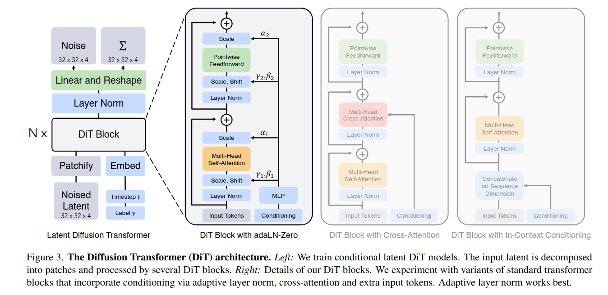

# DiT

## 前情提要

### Classifier-free guidance

回顾DDPM，训练优化目标是最大化似然函数 $p_{\theta}(\mathbf{x_0})$ 。而如何能使得模型生成符合我们希望的图片，则需要使用条件扩散模型。对于标签 $c$，此时优化目标则变为 $p_\theta(\mathbf{x}_0|c)$，扩散过程的逆过程则变为 $p_\theta(\mathbf{x}_{t-1}|  \mathbf{x} _{t},c)$

既要使得生成的样本符合数据（让 $p_\theta( \mathbf{x}|c)$ 最大），还要尽量符合条件（让 $p_\theta(c|\mathbf{x})$ 最大）。

由Bayes formula: $\log p(c|\mathbf{x} )\propto \log p(\mathbf{x}|c )-\log p(x)$

**实现思路：用无条件和有条件的score函数做线性插值**

将有条件预测与无条件预测组合起来，并用超参数 $s$（guidance scale)来控制条件的影响强弱。记有条件预测为 $\epsilon_\theta(x,\theta,c)$，无条件预测为 $\epsilon_\theta(x, \theta)$，则有

$$
\mathrm{guided}\,\mathrm{score}=\epsilon_\theta(x,\theta,c)+s\,[\epsilon_\theta(x,\theta,c )-\epsilon_\theta(x,\theta)]
$$

### Latent diffusion models

直接在高分辨率的像素空间训练扩散模型在计算上是非常困难的，因此需要引入LDM来分两步解决这个问题：(1) 使用autoencoder学习一个encoder $E$ 将图像压缩成一个较小的空间表示 ; (2) 由 $z=E(x)$ 训练一个扩散模型。新图像通过对 $z$ 采样再decode为图像从而学习一个decoder $x=D(z)$。

## Diffusion Transformer Design Space

<<<<<<< HEAD

### Patchify

输入到DiT的图像是一个尺寸为 $I \times I \times C$ ($I\times I$为图像的空间维度，$C$为通道数)的空间表示(spatial representation)。patchify的过程将图像划分为 $p\times p$ 的patch，然后将这些patches展开为一维序列，每个patch即为一个token，形成长度为 $T=(I/p^2)$ 的序列，每个块的嵌入维度是 $d$，从而构成 $T\times d$ 的输入序列送入模型。

**位置编码**

由于Transformer不具有空间关系的感知能力，因此需要位置编码帮助模型捕捉token之间的相对位置信息。

### DiT block design

每一个DiT块处理一个维度为 $d$ 的向量

### Transformer decoder

模型需要将生成的图像 token 序列解码为输出的噪声预测和输出的对角协方差预测，具有与原始图像相同的形状。

解码方式： 每个token都被解码为 $p\times p\times 2C$ 的张量，重新排列回原始的空间布局。

解码后输出图像的噪声预测和对角协方差预测，最终预测原始图像的噪声和协方差，从而完成扩散过程的逆操作。
